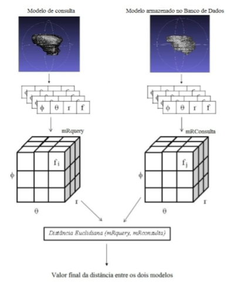
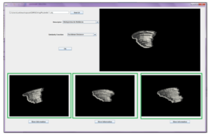

 

Os modelos tridimensionais fornecem uma visão mais completa dos objetos analisados por considerar a profundidade de cada um deles. Com o crescimento de modelos tridimensionais disponíveis atualmente na área de saúde, se faz necessária a implementação de mecanismos eficientes de busca, que ofereçam formas alternativas para localizar casos de pacientes com determinadas características. A disponibilização de um histórico de imagens similares em relação àquelas pertencentes ao exame do paciente pode auxiliar no diagnóstico oferecendo casos semelhantes. O presente projeto visa a desenvolver técnicas para recuperação de imagens médicas tridimensionais com base em seu
conteúdo, com foco no contexto médico, mais especificamente na área cardíaca.
Pretende-se contribuir com a detecção de anomalias por meio da disponibilização de quadros clínicos similares, gerando-se um protótipo de sistema de consulta. Para alcançar o objetivo proposto foram realizadas as seguintes etapas: revisão bibliográfica, definição da base de dados, implementção de extratores e funções de similaridade,
construção de um protótipo de sistema de recuperação, realização de testes com imagens médicas e análises dos resultados. Os resultados obtidos com os métodos desenvolvidos foram positivos, alcançando em alguns testes 90% de precisão no retorno da busca. Verificou-se que extratores que levaram em consideração a informação espacial das deformações obtiveram um resultado melhor do que os métodos que analisaram os modelos sob uma perspectiva global. Estes resultados confirmam o potencial que a recuperação por conteúdo possui no contexto médico podendo auxiliar na composição de diagnósticos e além de contribuir com a área de Computação no sentido de ter desenvolvido técnicas para recuperação por conteúdo no domíio de modelos tridimensionais.

Palavras-chaves: CBIR 3D, Insuficiência cardíaca congestiva, descritores de forma, imagens médicas
